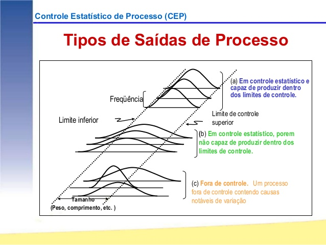

```{r setup, include=FALSE}
options(htmltools.dir.version = FALSE)
```

# Controle estatístico de processos

```{r echo=FALSE, message=FALSE, warning=FALSE}
knitr::include_graphics("./img/cep.png")
```
---
# Controle estatístico de processos

```{r echo=FALSE, message=FALSE, warning=FALSE}

```

---

# Variações e o CEP

```{r echo=FALSE, message=FALSE, warning=FALSE}
knitr::include_graphics("./img/Imagem1.png")
```

---

# Controle estatístico de processos

Os princípios do CEP fundamentam-se em: 

- pensar e decidir com base em fatos
- pensar separando a causa do efeito
- compreender a variabilidade do sistema de produção
- usar raciocínio de prioridade (Pareto)
- utilizar re forma permanente os ciclos de controle e melhoria de processos
- definir o próximo processo ou etapa como cliente da anterior e o  cliente deve determinar a qualidade esperada
- identificar, por vezes de maneira antecipada, os focos e locais onde problemas estão ocorrendo
- educar, treinar e organizar a mão de obra para administração participativa e autocontrole dos processos

---

# Técnicas de apoio
- Amostragem
- Folha de verificação
- Histograma
- Gráficos sequenciais
- Diagrama de Pareto
- Diagrama de causa e efeito
- Estratificação
- Gráficos de controle (ou cartas de controle ou Gráficos de Shewhart)
- Diagrama de correlação

---

# Variações e o CEP

Variação total = variação aleatória + variação controlável

## O Controle Estatístico de Processos (CEP) caracteriza-se por: 

- redução da variabilidade em medidas;
- exatidão em alcançar metas!

---

# Ações sobre o processo

## Mudanças nas operações
- Treinamento para os operadores;
- Mudanças nos materiais que entram

## Mudanças nos elementos mais básicos do processo
- Equipamento;
- A comunicação entre as pessoas;
- O projeto do processo como um todo - que pode estar vulnerável às mudanças de temperatura ou umidade.


---

# Ciclo da metodologia científica aplicado ao CEP
1. identificação da problemática e o planejamento de experimentos com a escolha adequada dos instrumentos de análise
2. experimentação 
3. análise de dados
4. reação dos gestores para melhoria do processo

---

# Inpeção x Controle

```{r echo=FALSE, message=FALSE, warning=FALSE}
knitr::include_graphics("./img/cep1.jpg")
```

---

# Gráficos de controle
## Principais objetivos de gráficos de controle:
1. Estimar os parâmetros do processo no cenário de controle estatístico, permitindo analisar sua capacidade;
2. Monitorar parâmetros da produção ao longo do tempo;
3. Sinalizar a ocorrência de causas de variação atribuíveis;
4. Reduzir a variabilidade do processo mediante eliminação das causas atribuíveis.

---

# Tipos de gráficos de control

- Gráficos de controle para variáveis
- Gráficos de controle para atributos

---

# Escolha dos instrumentos

```{r echo=FALSE, message=FALSE, warning=FALSE, out.width="50%"}
knitr::include_graphics("./img/Imagem2.png")
```

---

# Capabilidade - Capacidade

Capacidade do processo: é a amplitude que corresponde a 99,73% (6 sigma) da variação inerente ao processo (causas comuns) para um processo sob controle estatístico. Para estimarmos a capacidade do processo é necessário que a distribuição normal se adeque aos dados.

Um processo pode não ser capaz por:

- Apresentar elevada variabilidade   
- Apresentar média deslocada em relação ao ponto médio dos limites de especificação   

.center[
```{r echo=FALSE, message=FALSE, warning=FALSE, out.width="70%"}

```
]

---

# Índices de capacidade do processo

Os índices de capacidade processam as informações de forma que seja possível avaliar se um processo é capaz de gerar produtos que atendam às especificações provenientes dos clientes internos e externos. Os índices de capacidade são adimensionais e permitem uma quantificação do desempenho dos processos.

(a)	Cp: corresponde à Amplitude das Especificações (tolerâncias) dividido pela Capacidade do Processo;

Cp= (LSE-LIE)/6σ

(b)	Cpk: este índice avalia se o processo está centrado. Corresponde ao menor valor entre o Limite Superior de Especificação (LSE) menos a Média e a Média menos o Limite Inferior de Especificação (LIE), divido por metade da Capacidade do Processo (3 sigma);

Cpk=min[(LSE- μ)/3σ,(μ-LIE)/3σ]  


---
class: middle, center, inverse

# Índices de capacidade do processo

Se a média estiver centrada no valor nominal, quanto maior o valor de Cp, maior a capacidade do processo de satisfazer às especificações. O valor mínimo de Cp deve ser 1,33.

Quando a média do processo coincide com o valor nominal de especificação, teremos Cp = Cpk.

.center[
```{r echo=FALSE, message=FALSE, warning=FALSE, out.width="70%"}

```
]


---
class: middle, center, inverse

# Ciclo DMAIC

```{r echo=FALSE, message=FALSE, warning=FALSE, out.width="100%"}

```


---

# Ciclo DMAIC

```{r echo=FALSE, message=FALSE, warning=FALSE, out.width="100%"}

```


---

class: center, inverse

# Certificação Seis Sigma 

```{r echo=FALSE, message=FALSE, warning=FALSE, out.width="100%"}

```


---

# Mais informações sobre Capabilidade

.pull-left[
<iframe width="300" height="300" src="https://www.youtube.com/embed/gDRUEQcKaMo" frameborder="0" allow="accelerometer; autoplay; clipboard-write; encrypted-media; gyroscope; picture-in-picture" allowfullscreen></iframe>
]

.pull-right[
<iframe width="300" height="300" src="https://www.youtube.com/embed/rUlL61nXaKM" frameborder="0" allow="accelerometer; autoplay; clipboard-write; encrypted-media; gyroscope; picture-in-picture" allowfullscreen></iframe>
]


---
class: center, inverse, middle


# Métodos e modelos de gestão de processos


---

# World Class Manufacturing

### PERDA ZERO!

O World Class Manufacturing (WCM) é considerado uma evolução do Lean Manufacturing e consiste em um conjunto de princípios, métodos e ferramentas para que a organização alcance a excelência operacional. 

A excelência é resultado da melhoria contínua e ocorre de forma gradual, podendo atingir níveis bronze, prata e ouro. Esses níveis são auditados pela WCM Association. 

```{r echo=FALSE, message=FALSE, warning=FALSE, out.width="80%"}

```

---

# World Class Manufacturing

No WCM, esses princípios são classificados em 10 mais importantes e são eles que norteiam a implementação de qualquer pilar. 

1. Segurança em primeiro lugar;

2. Sem padrão, sem melhoria;

3. Voz do cliente;

4. Target = zero;

5. WCM é visual;

6. WCM é realizado no chão de fabrica;

7. Melhores práticas;

8. Rigor na aplicação;

9. Energia em crise;

10. Envolvimento de todos.

---

# Modelo de Excelência em Gestão (MEG)


```{r echo=FALSE, message=FALSE, warning=FALSE, out.width="80%"}

```

---

# Modelo de Excelência em Gestão (MEG)

Organização é um **sistema** e os elementos que a compõe são os **critérios de excelência**

Clientes são a razão de ser da organização
- NECESSIDADES
- VALOR

Organizações são parte da Sociedade
- SUSTENTABILIDADE

---

# Modelo de Excelência em Gestão (MEG)

- TOP-DOWN
- Desdobramentos de metas em níveis estratégico, tático e operacional
- Desempenho
- PESSOAS
- RESULTADOS
  - produção x produtividade
  - metas conflitantes
- Informações + conhecimento  

---

### 5S
Fase | Descrição
-----|----------
Seiri | organização/utilização/descarte: tem como objetivo otimizar os espaços, a alocação e utilização de móveis, equipamentos e materiais de trabalho em geral. 
Seiton | arrumação/ordenação: tem como objetivo ordenar racionalmente móveis, equipamentos, material de uso e documentos para facilitar o acesso e a utilização dos diversos recursos em um layout coerente. 
Seisou | limpeza/higiene: tem como objetivo deixar sempre limpo ou em condições favoráveis para uso os recursos físicos, móveis e equipamentos utilizados. 
Seiketsu | padronização: tem como objetivo cumprir as recomendações técnicas e manter as condições de trabalho e dos colaboradores, favorecendo a saúde com relação às limitações físicas e mentais. 
Shitsuke | autodisciplina: tem por objetivo criar uma cultura para educar, conscientizar e disciplinar o colaborador visando a um comportamento e a hábitos que motivem a melhoria contínua por meio da força física, mental e moral. 


